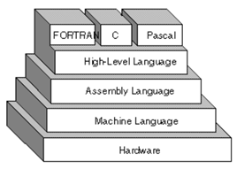
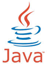
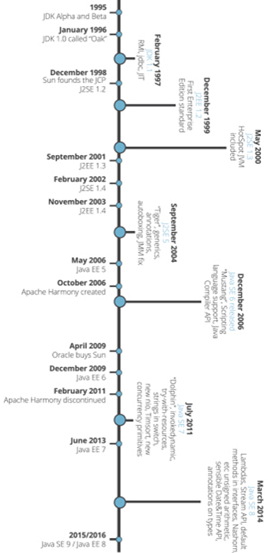
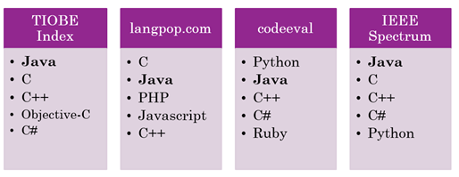
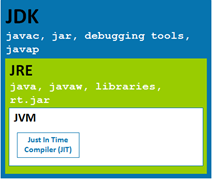
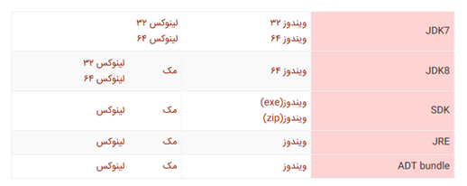
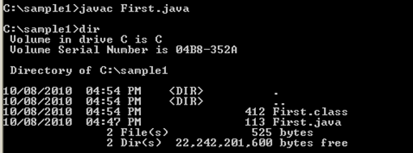
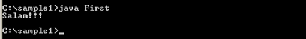

# 01-آشنایی با جاوا


در این فصل با زبان جاوا، تاریخچه، ویژگی ‎ها و جایگاه آن آشنا خواهیم شد، و در مورد اینکه چرا جاوا زبان مهمی هست صحبت خواهیم کرد. در آخر با نحوه‎ی نصب و راه‎اندازی جاوا برای برنامه‎نویسی آشنا خواهیم شد و اولین برنامه به زبان جاوا را می نویسیم و کامپایل و اجرا می کنیم.

## درباره جاوا

جاوا یک زبان و در واقع یک فن آوری برنامه نویسی است. یکی از پرکاربردترین زبان‎های برنامه نویسی دنیا و ایران در حال حاضر است. استفاده از زبان جاوا برای همگان رایگان است و متن پیاده سازی این زبان نیز به صورت آزاد در اختیار عموم است (اصطلاحا این زبان متن باز یا open source است). برنامه هایی که به این زبان نوشته می شوند روی انواع سیستم های مختلف مستقل از سخت افزار و سیستم عامل آنها قابل اجرا هستند. و در نهایت جاوا زبانی ساده و شی گرا (object oriented) است.

## تاریخچه


طراحی اولیه این زبان در سال 1991 توسط James Gosling در شرکت Sun Microsystem انجام شد. ساختار و گرامر زبان جاوا بسیار شبیه زبان C و ++C است. در ابتدا این زبان Oak (بلوط) نامگذاری شد، به افتخار درخت بلوطی که کنار پنجره اتاق آقای گاسلین روییده بود. اما کمی بعد به علت وجود زبان دیگری که قبلا به این نام ثبت شده بود، این زبان این بار با الهام از فنجان قهوه ی جاوایی که روی میز کار آقای گاسلین قرار داشت، جاوا نام گرفت. همین طور که می بینید طراحان این زبان حتی در نام گذاری هم سخت گیری نکرده اند و سعی کرده اند این سادگی در تمامی این زبان چه برای برنامه نویسان و چه برای کسانی که کدها جاوا را میخوانند رعایت کنند. شرکت سان اولین نسخه جاوا را در 1995 منتشر کرد، در سال 2010 شرکت سان توسط شرکت Oracle خریده شد و در حال حاضر این شرکت مالک معنوی جاواست و انتشار نسخه های جاوا توسط اوراکل انجام می شود.

## انگیزه طراحی زبان جاوا


انگیزه و طرح اولیه در ذهن طراحان جاوا طراحی زبانی مستقل از سکو (platform independent) بود، یعنی زبانی که مستقل از سخت افزار و سیستم عامل و سایر عوامل محیطی بتواند کار کند و برنامه هایی که به این زبان نوشته می شوند مستقل از این عوامل اجرا شوند. هدف این بود که این زبان در وسایل مختلف الکتریکی مورد استفاده قرار بگیرد و ما بتوانیم برنامه هایی بنویسیم که در وسایلی مثل یخچال یا جاروبرقی، خودروها و یا خیلی وسایل دیگر قابل جاسازی کردن و استفاده باشد، به طور کلی رویکر آن سال ها برنامه نویسی در راستای ایجاد وسایل هوشمند بود.
از طرف دیگر در همان سال ها اینترنت و وب هم در حال رشد و فراگیر شدن بودند و جاوا می توانست برای برنامه نویسی اینترنت هم مورد استفاده قرار بگیرد چرا که اینترنت مجموعه ای سیستم های مختلف (از نظر سخت و نرم افزاری) است و برنامه های جاوا به علت مستقل از سکو بودند برای این منظور مناسب بودند. برای این کاربرد java Applet ها ایجاد شدند و اهمیت پیدا کردند، جاوا اپلت ها برنامه هایی به زبان جاوا با قابلیت استفاده در فضای مجازی بودند.

## امروز و جاوا


اما امروز شرایط تا حدودی تغییر کرده است.

* نسخه ی سازمانی جاوا (Java Enterprise Edition) در سمت سرور بسیار پر استفاده است، و از آن برای کاربردهای خدمات اینترنت و وب کمک گرفته می شود.

* در قسمت تلفن های همراه جاوا در قالب سیستم عامل اندروید حضور یافته.

* و در دستگاه های الکترونیکی به صورت Java Micro Edition استفاده می شود.

* در کارت های هوشمند نیز به صورت Java Card مورد استفاده قرار می گیرد. در واقع نسخه های مختلف جاوا در کاربردهای مختلف بسیار مورد توجه و استفاده قرار گرفته اند. در واقع جاوا امروزه مهم تر از یک زبان برنامه نویسی و می توان گفت یک فن آوری برنامه نویسی است. یک اکوسیستم تولید نرم افزار است. این تکنولوژی شامل دو بخش مهم است: زبان برنامه نویسی و محیط توسعه.

* زبان برنامه نویسی که برای تولید انواع برنامه ها در کاربردهای مختلف مورد استفاده قرار می گیرد.

* و محیط توسعه شامل کامپایلر (javac)، اجرا کننده (java)، مولد مستندات (Javadoc) و بسیاری امکانات توسعه دیگر که در کنار هم فن آوری جاوا را تکمیل می کنند.

همچنین این اکوسیستم شامل شرکت های مختلف و نرم افزارهای بسیار متن باز و متنوعی هست که این فضا رو برای تولید نرم افزار، بهتر و  پیشرفته تر می کنند.

## جاوا و زبان های سطح بالا



بسیاری از زبان های برنامه نویسی که می شناسیم زبان هایی سطح بالا هستند، زبان های سطح بالا، زبان هایی هستند که از سطح زبان ماشین انتزاعی تر و به سطح تفکر انسان نزدیک تر هستند، همان طور که در شکل می بینید، زبان ماشین، شامل صفر و یک هایی هست که سخت افزار آنها را می فهمد، زبان اسمبلی که بر مبنای زبان ماشین نوشته شده است با استفاده از برچسب هایی برنامه نویسی را برای انسان ساده تر کرده است، اما بسیاری از زبان هایی که ما می شناسیم از این هم انتزاعی تر و به زبان انسان نزدیک تر هستند، مانند C،  Fortran، Pascal و زبان هایی از این دست، از این منظر زبان جاوا هم یک زبان سطح بالاست.

## ماشین مجازی جاوا

در اجرای برنامه های جاوا یک مولفه خاص به نام Java Virtual Machine یا همان ماشین مجازی جاوا وجود دارد که در واقع برنامه های جاوا با کمک این مولفه اجرا می شوند، همان طور که می دانید مهم ترین لایه ی نرم افزاری که روی سخت افزار اجرا می شود سیستم عامل است، مانند ویندوز، لینوکس، مک یا هر سیستم عامل دیگری که روی سخت افزار اجرا می شوند و برنامه های ما را اجرا می کنند. در واقع برنامه های ما معمولا روی سیستم عامل اجرا می شوند، اما برنامه های جاوا دارای یک لایه ی واسط به نام JVM (مخفف ماشین مجازی جاوا)  هستند که این واسط روی سیستم عامل و برنامه های جاوا توسط JVM اجرا می شوند.
اگر ما بخواهیم یک برنامه جاوا را اجرا کنیم، بایست مراحلی مانند زیر را برای کامپایل و اجرا کردن آن طی کنیم. ابتدا برنامه ای به زبان جاوا با پسوند .java نوشته می شود، سپس با کمک کامپایلر جاوا (javac) این برنامه کامپایل و به زبان میانی به نام بایت کد ترجمه می شود، فایل هایی که حاوی بایت کد هستند پسوند .class دارند. این بایت کد ها رو سیستم عامل ها مختلف قابل اجرا هستند. مثلا ما روی یک سیستم با سیستم عامل ویندوز می توانیم یک jvm نصب کنیم و این ماشین مجازی می داند که برنامه ها به زبان میانی (بایت کدها) را چگونه بر روی سیستم عامل ویندوز اجرا نماید، به همین صورت برای سیستم عامل های مختلف jvm های مختلف وجود دارد.


به این دقت کنید که این لایه میانی در زبان هایی مانند C و ++C وجود ندارند و برنامه ای که به این زبان ها نوشته می شود مستقیما بر روی سیستم عامل اجرا می شوند و لایه میانی مانند jvm در این زبان ها وجود ندارد. همچنین در برخی زبان ها مانند خانواده ی .Net Framework مانند C# نیز این لایه میانی وجود دارد و دات نت فریم ورک نقش jvm را برای آنها ایفا می کند و آنجا هم برنامه ها به زبان میانی ترجمه می شوند و زبان میانی توسط دات نت فریم ورک اجرا می شود اما تنوعی که در جاوا وجود دارد برای سیستم هایی که می تواند روی آنها اجرا شود در این زبان ها (خانواده ی دات نت) وجود ندارد و تاکیدی که بر مستقل از سکو بودن در جاوا هست در خانواده دات نت بسیار کم وجود دارد چرا که دات نت مربوط به شرکت مایکروسافت است و این شرکت سیستم عامل ویندوز را ترجیح داده است.
اگر بخواهیم وضعیت اجرا شدن زبان‎های مختلف روی سیستم عامل ها و نهایتا سخت افزار را بررسی کنیم به نتایج زیر خواهیم رسید، همان طور که در شکل می بینید برنامه هایی به زبان پاسکال و یا ++C پس از کامپایل شدن مستقیما به فایل قابل اجرا برای سیستم عامل تبدیل و روی سیستم عامل اجرا می شوند، در حالی که برنامه های نوشته شده توسط زبان های خانواده دات نت و برنامه های جاوایی به زبان میانی ترجمه و سپس توسط ماشین مجازی (jvm برای جاوا و .Net framework برای C# و VB.NET) روی سیستم عامل اجرا می شوند.


## اصطلاحات

در این قسمت به بررسی برخی اصطلاحات که در مورد مستقل از سکو بودن زبان جاوا به کار می روند خواهیم پرداخت. این اصطلاحات به شرح زیر هستند:

* Platform independence
* Cross-Platform
* Portable
* Architecture Neutral
* Write Once Run Anywhere
تمامی این اصطلاحات حاوی این معنی هستند که برنامه های جاوا را می توان بدون هیچ تغییری در سیستم های مختلف اجرا نمود (برنامه هایی قابل حمل هستند) و نتیجه ی اجرای برنامه روی این محیط های مختلف یکسان خواهد بود.

## برخی ویژگی های زبان جاوا

* سادگی: از ابتدا تلاش طراحان جاوا بر این بوده است که این زبان تا حد ممکن ساده باشد و ساختارهای پیچیده ای نداشته باشد.
* شی گرایی: جاوا زبانی مبتنی بر اشیا است یعنی شهروند و موجودیت درجه اول در این زبان اشیاء هستند.
* مستقل از سکو: همان طور که در قسمت های قبل اشاره شد، برنامه های جاوا قابل اجرا و حمل بر روی سیستم های مختلف با سخت افزارها و سیستم عامل های مختلف هستند.
* امنیت: جاوا زبانی امن است به این معنا که دارای امکاناتی برای جلوگیری از بسیار از مشکلات امنیتی می باشد.
* اجرا به صورت تفسیری (interpreted): یعنی هر برنامه به زبان جاوا در ابتدا به بایت کد ترجمه (کامپایل) شده و سپس این کد میانی خط به خط ترجمه (تفسیر) می شود.
* چند نخی (multithreaded): این امکان در جاوا وجود دارد که برنامه ها به صورت چند نخی نوشته و به صورت موازی و یا هم روند اجرا شوند.
البته در مورد این ویژگی ها نکاتی هم مطرح است مثلا اینکه آیا با توجه به تغییراتی که جاوا در طی این حدود 20 سال داشته و ویژگی ها و امکاناتی که به آن اضافه شده است، آیا هنوز زبانی ساده به حساب می آید؟
یا اینکه جاوا زبانی شی گراست اما در نسخه های جدید (جاوا 8 به بعد) از امکانات تابعی (Functional) هم پشتیبانی می کند، اما با این وجود هنوز هم این زبان به عنوان یک زبان شی گرا توصیف می شود.

## چرا فن آوری جاوا مهم است؟



ویژگی های مختلفی در این فن آوری وجود دارد که موجب اهمیت آن می شود:

* اولین علت این است که یادگیری جاوا ساده است.
* همچنین زبانی شی گرا و مناسب برای کاربردهای امروزی است.
* این زبان دارای API ها و کلاس های کمکی بسیار غنی است، این امکانات در حوزه های مختلفی مانند کار با ساختمان داده های مختلف، کار با فایل، کاربردهای شبکه، پایگاه داده و بسیاری امکانات متنوع دیگر است.
* و ابزارهای توسعه بسیار قوی در اطراف این زبان ایجاد شده اند که برنامه نویسی با کمک جاوا را بسیار ساده می کنند، ابزارهایی مانند محیط های توسعه (Eclipse, NetBeans, Intellij Idea ) و سایر ابزارهایی که توسعه را آسان تر می کنند (مانند Ant و Maven)، این ابزارها اگرچه جزو زبان جاوا نیستند، اما کسانی آنها را به صورت رایگان و متن باز در اختیار ما قرار داده اند.
* جاوا دارای کتابخانه های متن باز بسیار غنی است، این کتابخانه ها که توسط شرکت هایی مانند Apache، google،  SourceForge فراهم شده اند و ما می توانیم از آنها استفاده نماییم.
* جاوا انجمنی بسیار قوی دارد (Java Community) که برنامه نویسان و فعالان این حوزه در آن به تبادل اطلاعات می پردازند. این انجمن اعضای بسیار در دنیا و در ایران دارد و این یکی از نقاط قوت این زبان محسوب می شود، برای پی بردن به این ویژگی کافیست یک سوال جاوایی را در سایتی مانند StackOverflow جست و جو کنید.
* جاوا رایگان و متن باز است و این دو ویژگی برای یک زبان برنامه نویسی بسیار مهم است.
* مستندات بسیار خوبی در زمینه این زبان وجود دارد (بسیاری از آنها توسط Javadoc تولید شده اند که در بخش های بعد در مورد آن صحبت خواهیم کرد.
* جاوا مستقل از سکو است  
* این زبان زبانی بالغ است و در فراز و فرودهای بیش از دو دهه به خوبی دوام آورده، و زبان جدیدی نیست که تغییرات کسب و کار بتواند به راحتی آن را زمین بزند.
* سهم مهمی از بازار تولید نرم افزار در اختیار جاواست. برنامه های سمت سرور، برنامه های موبایل و غیر
* جاوا هم در محیط های دانشگاهی و هم در پروژه های صنعتی محبوب است.
* همچنین JVM در حال حاضر به زبان های مهمی مانند Groovy و Scala نیز سرویس می دهد و حتی اگر از زبان جاوا استفاده نکنید، می توانید از امکانات ماشین مجازی جاوا برای توسعه برنامه هایی به این زبان ها بهره ببرید. و این مجموعه از زبان ها (زبان هایی که از JVM برای اجرا شدن استفاده می کنند) رو به گسترش هستند.


## ویراست های فن آوری جاوا


زبان جاوا دارای ویراست(edition) های مختلفی است:

* Java Standard Edition: نسخه ی اصلی جاوا است
* Java Enterprise Edition: نسخه ی سازمانی این زبان است که برای نوشتن برنامه های بسیار بزرگ که احتمالا کاربران زیادی هم دارد و در بستر وب ارائه می شوند مورد استفاده قرار می گیرد.
* Java Micro Edition: این ویراست که JME هم گفته می شود برای سخت افزارهای بسیار محدود و کوچک با منابع کم مورد استفاده قرار می گیرد مانند گیرنده های دیجیتال، تلوزیون ها، وسایل الکترونیکی و مواردی مانند اینها
* و Java Card که برای کارت های هوشمند مورد استفاده قرار می گیرد.
زبان جاوا در Java Standar Edition طراحی و توصیف شده است و ما در این کتاب قصد بررسی همین ویراست را داریم و البته زبانی که در JEE (Java Enterprise Edition) مورد استفاده قرار می گیرد هم همین ویراست است. در واقع زبانی که در ویراست سازمانی مورد استفاده قرار می گیرد هم همین زبان است و تنها در نسخه های JME و Java Card این زبان قدری محدود تر شده است.

## داستان زندگی جاوا


واقعیت این است که جاوا زندگی پر فراز و نشیبی را پشت سر گذاشته است، این زبان با امید استفاده در وسایل الکترونیکی مختلف طراحی شد، و با فراگیر شدن اینترنت با اپلت ها معروف و پر استفاده شد، مدتی بعد با رونق پیدا کردن تلفن همراه، JME روی کار آمد و برای مدتی پیشرفته ترین زبان برنامه نویسی روی تلفن های همراه به حساب می آمد.
این وضعیت امروزه خیلی تغییر کرده است، applet ها تقریبا بی اهمیت شده اند و سهم JME از بازار موبایل تقریبا ناچیز است، اما جاوا همچنان بسیار مهم است و نقش های مختلف دیگری را ایفا می کند، در بخش برنامه نویسی وب، و برنامه نویسی سمت سرور جاوا مهم بوده و هست، و در مورد تلفن های همراه نیز، جاوا با اندروید موفق شد مجددا سهم خودش از بازار موبایل را به دست آورد.

## تاریخچه نسخه های جاوا

همان طور که در بخش های قبل هم اشاره کردیم نسخه های اول جاوا در سال 1995 توسط سان مایکرو سیستم ارائه شد، این نسخه ها، نسخه هایی آزمایشی بودند، نسخه اول این زبان در سال 1996 ارائه شد و بعد از آن تا سال 2014 نسخه های مختلفی از این زبان به مرور منتشر شدند، در این میان نسخه هایی که تغییرات مهم و زیادی داشته اند از اهمیت و شهرت بیشتری برخوردار هستند، نسخه ی دوم جاوا در سال 1998 ارائه شد که علی رغم اینکه نسخه ی 1.2 جاوا بود، به علت اهمیت به نسخه ی 2 جاوا معروف شد، به این نسخه J2SE نیز گفته می شود و بعد از این نسخه این اسم روی زبان جاوا باقی ماند و در نسخه های 1.3 و 1.4 هم به جاوا J2SE گفته می شد، در نسخه ی 1.5 (سال 2004) که بعد ها نسخه ی 5 نام گرفت عدد 2 از نام نسخه حذف شد و دیگر به جاوا J2SE گفته نمی شد و به آن Java SE مخفف نسخه ی استاندار جاوا گفته می شد، قابل ذکر است که نسخه ی 5 هم نسخه ی مهمی به شمار می آید، بعد از آن نسخه ها به همان ترتیب نسخه ی 6، 7، و 8 نام گرفتند، از این میان بیشترین سهم تغییرات را در نسخه های اخیر، نسخه ی 5، 7 و 8 بر عهده داشته اند، در نسخه ی 5 امکاناتی مانند کلاس های عام (Generics) و حاشیه نگاری (Annotation) معرفی و افزوده شدند، در نسخه ی 8 هم عبارات لامبدا و جویبارها(Streams) به زبان اضافه شدند که برنامه نویسی تابعی را ممکن می سازند.


به این نکته دقت کنید که اصطلاحاتی مانند J2SE، J2ME و J2EE اصطلاحاتی هستند که مربوط به نسخه ی 1.2 جاوا هستند، اگرچه هنوز برخی برنامه نویسان و فعالان این حوزه از این عبارات استفاده می کنند، اما بهتر است به جای آن از اسامی Java SE، Java ME و Java EE برای نسخه های فعلی این زبان استفاده کنیم.



## محبوبیت زبان های برنامه نویسی

در عین حال زبان جاوا امروزه زبان محبوب و در بین زبان های برنامه نویسی از رتبه ی بالایی برخوردار است. مراجع مختلفی زبان های برنامه نویسی را از لحاظ محبوبیت و میزان استفاده رتبه بندی کرده اند که در ادامه چهار رتبه بندی را مرور می کنیم:



همان طور که می بینید در هر چهار رتبه بندی زبان جاوا زبان مهمی هست. بیایید به دیگر زبان ها هم نگاهی داشته باشیم، مثلا زبان C یا ++C هم در اکثر رتبه بندی ها در جایگاه بالایی قرار دارد، و برخی از زبان ها هم به تازگی و بیش از پیش دارای اهمیت شده اند، مثلا زبان هایی اسکریپتی مانند Java Script،  Ruby و Python.

* اما بین این همه زبان برنامه نویسی، آیا زبان جاوا بهترین زبان برنامه نویسی دنیا است؟
* البته که نه! پس چه زمانی بهترین زبان برنامه نویسی دنیاست؟


واقعیت این است که هیچ زبانی بهترین نیست، هیچ زبانی وجود ندارد که بتوانیم بگوییم بهترین زبان برنامه نویسی دنیاست و از همه نظر از دیگر زبان ها بهتر هست، هر زبان برنامه نویسی مزایا و معایبی دارد و مناسب برای برخی کاربردهاست. نکته ای که مهم است این است که با توجه به هدفی که داریم زبان درستی را انتخاب کنیم و در انتخاب مراقب باشیم زبان مورد نظر از رده خارج نباشد.
البته نکته خوب در مورد جاوا این است که در حوزه های متنوع و مختلفی نقش ایفا می کند و برنامه نویس جاوا می تواند برای برنامه نویسی موبایل، برنامه نویسی سمت سرور و حوزه های مختلف دیگری فعالیت کند.

## اولین برنامه به زبان جاوا

در این بخش می خواهیم اولین برنامه به زبان جاوا را به کمک هم بنویسیم، پیش از شروع می خواهیم مرور سریعی بر شرایطی که برای برنامه نویسی جاوا لازم داریم بکنیم. یا اصطلاحا ببینیم که چطور می توانیم محیط برنامه نویسی جاوا را نصب و راه اندازی کنیم.



* دریافت و نصب JDK:

برای برنامه نویسی جاوا ابتدا به نصب و فراهم کردن JDK داریم، Java Development Kit این نرم افزار به شما اجازه می دهد برنامه های جاوا را کامپایل و اجرا نمایید. به این دقت داشته باشید که JDK و JRE با هم متفاوت هستند، JDK مجموعه ای از نرم افزارهاست که به شما امکان اجرای برنامه های جاوا را می دهد و به درد برنامه نویسان جاوا می خورد اما JRE بخش کوچکی از JDK را شامل می شود که تنها برای اجرای برنامه های جاوا کافی هست، بنابر این اگر کسی بخواهد یک برنامه جاوا را فقط اجرا کند، JRE برای این کار کافیست، اما اگر کسی بخواهد برنامه جاوا بنویسد و کامپایل و اجرا و احتمالا دیباگ کند، باید JDK در اختیار داشته باشد. و هر کدام از این دو مورد به صورت مستقل قابل دریافت (دانلود) و نصب کردن هستند.
برای دریافت این پکیج ها می توانید به سایت اوراکل، جاواکاپ و یا سایر سایت های ایرانی یا خارجی مراجعه کنید. هنگام انتخاب پکیج به نسخه آن توجه کنید، چرا که همان طور که در بخش قبل دیدیم، برخی ویژگی ها از نسخه ای به بعد به این زبان اضافه شده اند. همچنین لازم است پکیجی متناسب با سیستم عامل خود دریافت کنید، برای مثال اگر از ویندوز، لینوکس یا مک استفاده می کنید، به راحتی می توانید نسخه ی مورد نظر خود را پیدا کنید، و معمولا JDK در دو نسخه 32 و 64 بیت ارائه می شود که برای انتخاب این ویژگی نیز به وضعیت سخت افزاری سیستم خود رجوع کنید. در شکل زیر بخشی از سایت جاواکاپ (بخش دانلودها) که در آن نسخه های مختلف JDK برای سیستم عامل های مختلف قرار داده شده است را می توانید ببینید:



نصب جاوا به دو طریق میسر است، اول با اجرا کردن فایل های اجرایی مورد نظر (exe برای ویندوز یا rpm برای لینوکس) و راه دیگر از طریق extract کردن فایل فشرده حاوی نسخه جاوا در محل مناسب. همچنین توصیه می کنیم:

* متغییر محیطی path را با افزودن مسیر قرار گرفتن فایل های اجرایی جاوا به آن ویرایش کنید تا بتوانید به راحتی از دستوراتی مانند javac در تمام دایرکتوری های سیستم خود استفاده نمایید.
* مسیر نصب جاوا را تا حد امکان در آدرسی بدون فاصله قرار دهید، مثلا در ویندوز: c:/java/jdk به جای c:/program files
برای اجرای اولین برنامه قصد نداریم از محیط های توسعه (IDE) مانند eclipse یا intellij استفاده کنیم، گر چه این محیط ها برنامه نویسی را ساده تر می کنند، اما بخش هایی از روند اجرای برنامه را از دید ما پنهان می کنند و می خواهیم در اولین تمرین ها با استفاده از command line تمامی مراحل کامپایل و اجرای برنامه به زبان جاوا را مشاهده کنیم.

## اولین برنامه


برای نوشتن اولین برنامه به زبان جاوا یک فایل متنی با نام First.java بسازید، برای ساختن این فایل می توانید از برنامه هایی مانند notepad در ویندوز و gedit در لینوکس استفاده کنید. دقت کنید که پسوند این فایل مثلا .txt نباشد و دقیقا پسوند .java داشته باشد. به نحوه ی نام گذاری فایل ها دقت کنید، مثلا اینکه فایل های برنامه نویسی در جاوا با پسوند جاوا هستند.
سپس این خطوط را در این فایل متنی بنویسید:

```java
public class First {
   public static void main(String[] args) {
      System.out.println("Salam!!!");
   }
}

```

این برنامه دارای جزئیاتی است که هنوز در مورد آنها صحبت نکرده ایم و آموزش آنها شروع نشده است، فعلا می توانید حفظ کنید که این برنامه ساده می تواند رشته ای را در خروجی چاپ نماید.

## گام‌های لازم برای اجرای یک برنامه جاوا

هنگامی که برنامه را در فایل متنی نوشتیم، بایست مراحل زیر را برای اجرای آن طی کنیم:

* ابتدا برنامه باید کامپایل و به بایت کد تبدیل شود. برای کامپایل کردن برنامه های جاوا از دستور javac (java Compiler) استفاده می شود. به این صورت که بعد از این دستور نام فایلی که قصد کامپایل کردن آن را داریم می نویسیم:
Javac First.java
بعد از اجرای این دستور، در صورتی که برنامه شما صحیح و سالم باشد و خطایی نداشته باشد، کامپایل شده و فایل بایت کدی با پسوند .class و هم نام فایل اولیه ساخته می شود (در اینجا First.class)
* برای اجرا کردن این برنامه از دستور java استفاده می کنیم، به این صورت که بعد از این دستور نام کلاس را بدون هیچ پسوندی می نویسیم:
Java First
این دستور عملا ماشین مجازی جاوا را فراخوانی و برنامه ما را اجرا می نماید.


مثال عملی:
در این قسمت می خواهیم دستوراتی که یاد گرفتیم را در خط فرمان ویندوز اجرا و نتیجه را قدم به قدم مرور کنیم. پنجره خط فرمان در ویندوز را می توانید با جست و جوی عبارت cmd و یا جست و جوی برنامه run و سپس نوشتن عبارت cmd در پنجره run باز کنید. سپس با دستور dir می توانید لیست فایل های موجود در مسیر (دایرکتوری) جاری را ببینید:


همان طور که در شکل می بینید در ابتدا تنها فایل First.java که همان فایل متنی هست که کد آن را در قسمت قبل نوشتیم در این مسیر وجود دارد، (برای رفتن به مسیری که فایل شما در آن واقع است می توانید از دستوراتی مانند cd مخفف  change directory استفاده کنید و در صورت بروز مشکل از جست و جو در اینترنت کمک بگیرید) حال دستور کامپایل را اجرا و مجددا لیست فایل های موجود را مشاهده می کنیم:



خواهید دید که فایل First.class که حاوی بایت کد برنامه ما هست به فایل ها اضافه شده است. و در نهایت با دستور java ماشین مجازی را برای اجرای برنامه خود فراخوانی می کنیم:



در این حالت برنامه ما اجرا و عبارت سلام در خط فرمان چاپ می شود.
همچنین می توانید داخل پرانتز تابع println به جای یک متن، یک عدد صحیح و یا اعشاری بنویسید و برنامه را مجددا کامپایل و اجرا کنید، خواهید دید که پس از اجرای برنامه آن عدد در خروجی نمایش داده خواهد شد. و یا می توانید برای جدا کردن ارقام اعداد از underline استفاده کنید.
همانظور که در مثال زیر مشاهده می کنید، می توانیم به جای یک مقدار، از یک عبارت ریاضی استفاده کنیم و برنامه جاوا آن را محاسبه و نتیجه را برای من چاپ خواهد کرد، البته در مورد جزئیات نحوه ی کار با عملگرها در زبان جاوا، در فصل های بعد صحبت می کنیم.


نکاتی درباره اولین مثال:

* یک برنامه ساده یک فایل متنی با پسوند .java خواهد بود. این فایل شامل یک کلاس است که در مثال قبل ما اسم آن را First گذاشته بودیم (درباره مفهوم کلاس بعدا صحبت می کنیم)
* اسم کلاس باید دقیقا با اسم فایل منطبق باشد، بزرگ و کوچک بودن حروف در جاوا مهم است. (اصطلاحا گفته می شود جاوا زبانی case sensitive است) پس اگر نام کلاس با حرف بزرگ نوشته شده است، نام فایل نیز بایست با حرف بزرگ شروع شود.
* و کلاس ما شامل یک متد main بود که کوچک و بزرگ بودن نام این تابع نیز اهمیت دارد. و هر وقت که ما یک برنامه جاوا را اجرا می کنیم، به صورت اتوماتیک متد main صدا زده می شود و اجرا می شود.

## کویز


در این بخش با دو سوال کوتاه مفاهیمی که یاد گرفتیم را مرور می کنیم:

1. از بین برنامه هایی که نام آنها در زیر آمده است، مشخص کنید کدامشان برنامه های مستقل از سکو هستند؟ (اگر چندتا هستند همه را مشخص کنید) در واقع باید بگویید آیا این برنامه ها را می توان مستقل از سخت افزار و سیستم عامل و سایر عوامل محیطی روی هر سیستمی اجرا کرد یا نه.

    * Microsoft Word
    * JVM
    * Firefox
    * First.java
    * First.class
  
    پاسخ:

    * برنامه Microsoft word برای ویندوز طراحی و ساخته شده است و قابل اجرا در لینوکس یا سایر محیط ها نیست.
    * خود Jvm مستقل از سکو نیست، و برنامه ای است که برای platform های مختلف عرضه شده است و همان طور که دیدیم هنگام دانلود JDK که حاوی JVM هم هست بایست مشخص کنیم که این پکیج را برای کدام سکو و سیستم عامل لازم داریم.
    * Firefox که یک مرورگر صفحات وب هست نیز مستقل از سکو نیست، به این معنا که همان فایرفاکسی که در ویندوز اجرا می شود قابل اجرا و استفاده در لینوکس نخواهد بود، البته فایرفاکس برای لینوکس یا سایر محیط ها هم وجود دارد، اما برنامه اجرایی فایرفاکسی که در ویندوز اجرا می شود با لینوکس با سایر محیط ها متفاوت است.
    * دو مورد آخر یعنی First.java و  First.class مستقل از سکو هستند، البته First.java خودش قابل اجرا نیست ابتدا باید به First.class ترجمه شود و سپس توسط ماشین مجازی جاوا اجرا شود. در واقع همان  First.class ای که در ویندوز اجرا می شود بدون نیاز به هیچ تغییری قابل اجرا در سایر محیط ها هست و نتیجه اجرا در سیستم عامل ها و محیط های مختلف یکسان خواهد بود.

2. برنامه ای که در زیر نوشته شده است، دارای اشکالاتی هست، سعی کنید آنها را پیدا کنید و به جزئیاتی مانند نام فایل و یا سایر نام گذاری ها هم دقت کنید:


پاسخ:

* اولین اشکال این است که اسم کلاس و نام فایل باید یکسان باشد، مثلا اگر نام فایل intro.java هست، نام کلاس هم باید intro باشد، این یک اشکال نحوی است که کامپایلر آن را نشان خواهد داد.
* اشکال بعدی این است که باید نام متد main  را با حروف کوچک می نوشتیم در حالی که با حروف بزرگ نوشته ایم، اما این یک اشکال نحوی نیست، اصطلاحا syntax error نداریم و برنامه ها بدون خطا قابل کامپایل شدن است. این یک اشکال منطقی است و موجب می شود برنامه ما اجرا نشود.
* و یک اشکال دیگر هم هست، بهتر است اسم کلاس را با حرف بزرگ شروع کنیم مانند First که قبلا نوشته بودیم، این یک قانون نیست، اما عرفی است که بین برنامه نویسان جاوا وجود دارد. در واقع این یک قرارداد بین برنامه نویسان جاواست.

## جمع بندی

* ما در این فصل دیدیم که جاوا زبان بسیار مهم و پرکاربردی هست.
* در مورد تاریخچه و ویژگی های این زبان با هم صحبت کردیم.
* و دیدیم که جاوا در واقع فراتر از یک زبان برنامه نویسی است، یک فن آوری و بستر برنامه نویسی است. در در حول و حوش این زبان یک اکوسیستم تولید نرم افزار ایجاد شده است که امروزه یکی از مهم ترین رویکرهای تولید نرم افزار در دنیا هست.

## جست و جو کنید و بخوانید


پیشنهاد می کنیم در مورد مفاهیمی که در این فصل در مورد آنها صحبت کردیم، جست و جو کنید و بخوانید، مخصوصا از گوگل و ویکی پدیا استفاده کنید و چند صفحه ای در مورد این مفاهیم بخوانید:

* جاوا چه مزایایی دارد؟
* حتی جاوا چه معایبی دارد؟ و منتقدین جاوا چه انقادهایی به این زبان وارد کرده اند؟
* و طرفداران جاوا چه پاسخ هایی داده اند؟ مثلا آیا جاوا کند است؟
* و یا اینکه این زبان چه امکاناتی برای افزایش سرعت برنامه ها فراهم کرده است؟ مثلا Hotspot در جاوا چیست؟

و یا کلید واژه های دیگری که به این موضوع مرتبط هستند مانند:

* Java
* JVM
* Byte Code
* Java Mobile
* Oracle

و یا در مورد مقایسه این زبان با سایر زبان ها بخوانید:

* Java & [Element: span] ++C
* Java & C#
* Java & javascript

## تمرین

1. به عنوان اولین تمرین حتما JDK را دانلود و نصب کنید.
2. برنامه ای بنویسید که اسم شما را در خروجی چاپ کند.
3. این برنامه را کامپایل و اجرا کنید. این کار را مانند آنچه در این فصل یاد گرفتیم بدون استفاده از محیط های توسعه و با کمک دستورات خط فرمان انجام دهید تا این فرآیند را خوب یاد بگیرید و اینکه در هر مرحله چه فایلی تولید می شود را شخصا مشاهده نمایید.


