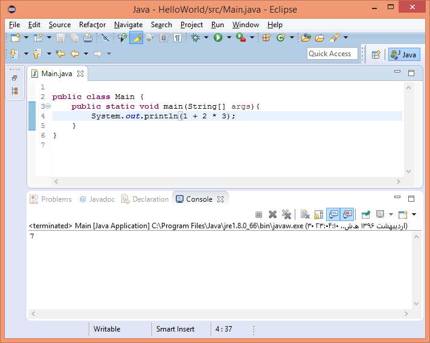

# 02- مفاهیم اولیه زبان جاوا

در این فصل ابتدا در مورد محیطهای توسعه نرم‌افزار صحبت می کنیم و با
برخی از این محیط های آشنا می شویم، سپس سراغ ساختارهای مختلف زبان جاوا خواهیم رفت. ابتدا متغیرها و نحوه ی تعریف کردن و استفاده از آنها را می‌بینیم، درباره انواع داده ی اولیه در زبان جاوا صحبت می کنیم، عملگرها و
ویژگی های آنها را بررسی می کنیم و درباره ساختار کنترل جریان برنامه و شرط
ها می خوانیم، بعد از آن در مورد انواع حلقه ها در زبان جاوا و ویژگی های
هر کدام صحبت می کنیم و در نهایت با متدها، تعریف آنها و نحوه‌ی استفاده از آن‌ها آشنا می شویم.

## محیط‌های توسعه

محیط‌های توسعه یا محیط‌های توسعه‌ی یکپارچه (Integrated Development Environment)، برنامه هایی هستند که ما از آنها برای برنامه نویسی استفاده می کنیم، و در واقع برنامه های خود را در آن‌ها می‌نویسیم.
این محیط‌ها مجموعه‌ای از امکانات مورد نیاز برنامه نویس را گردآوری کرده‌اند و به صورت یکپارچه در اختیار برنامه نویس قرار می‌دهند تا بتواند کارش را سریع‌تر و بهتر انجام دهد. در واقع IDE ها مانند جعبه ابزاری در دست برنامه‌نویس هستند.

-   مزایای محیط‌های توسعه

استفاده از محیط های توسعه مزایای مختلفی دارد، برنامه نویسی را آسان تر و
سریع‌تر می‌کند خطای برنامه نویسی را کاهش می‌دهد و کارهایی که قابل خودکار سازی هستند را خودکار می کند. البته باید توجه داشت که می‌توان بدون استفاده از این محیط‌ها هم برنامه نویسی کرد، مثلا برنامه را درون notepad نوشت و توسط خط فرمان (cmd در ویندوز یا terminal در سیستم‌عامل‌های دیگر) آن را کامپایل و اجرا کرد، مشابه آن‌چه در فصل قبل دیدیم، اما این کار برنامه نویسی را خیلی سخت و احتمال اشتباهات را زیاد می‌کند.

-   امکانات محیط‌های توسعه

محیط‌های توسعه به ما کمک می‌کنند تا برنامه را کامپایل و اجرا کنیم،
برنامه را رفع اشکال (debug) کنیم و مثلا آن را خط به خط اجرا
کنیم و در هر بخش مقدار متغیرها و یا ویژگی های مختلف برنامه‌مان را بررسی کنیم و به دنبال اشکال برنامه بگردیم. همچنین کمک می‌کنند تا خطاها و هشدارهای مربوط به برنامه‌مان را راحت‌تر ببینیم و پیگیری کنیم.

در تولید کد و نیز تکمیل کد به ما کمک می کنند، به این امکان Autocomplete گفته می شود. همچنین امکانات مناسبی برای جست‌وجو در بین کدها و فایل‌های پروژه در اختیار ما قرار می‌دهند و همچنین برای تغییر بخشی از فایل‌ها یا پروژه‌ها و کلاس‌ها امکانات خودکارسازی فراهم می‌کنند.

همچنین امکانات فرعی و جنبی دیگری نیز توسط محیط های توسعه فراهم می شوند مانند اتصال به مخزن کد (Code repositories) و یا سایر
امکانات بصری مانند شکل ها و گراف ها و \....

-   محیط های توسعه در جاوا

محیط های توسعه مختلفی برای جاوا وجود دارند که از بین آنها محبوب ترین محیط ها اینها هستند:

1.  Eclipse

این محیط توسط بنیاد اکلیپس توسعه داده و منتشر شده است. از محیط‌های توسعه محبوب میان برنامه‌نویسان جاواست که به صورت نرم‌افزار آزاد و رایگان در دسترس قرار می‌گیرد. همچنین امکان توسعه برنامه‌ها برای محیط اندروید و زبان‌های سی/سی‌پلاس‌پلاس و پایتون و .. هم در این محیط وجود دارد.

همچنین جامعه کاربری (Community) این محیط توسعه بسیار فعال هستند و آن را به خوبی پشتیبانی می‌کنند.

2.  NetBeans

این محیط، محصول مشترک oracle (سازندگان جاوا) و بنیاد آپاچی‌ است. بنیاد آپاچی در توسعه محصولات جاوایی سابقه طولانی دارد و محصولات پرکاربرد دیگری مانند maven نیز عرضه کرده‌است. این محیط توسعه هم مانند Eclipse به صورت نرم‌افزار آزاد عرضه شده و قابلیت توسعه نرم‌افزار به زبان‌های php و سی‌/سی‌پلاس‌پلاس و جاوا اسکریپت را نیز دارد.

3.  Intellij Idea

این محیط توسعه، امروزه یکی از محبوب‌ترین و پرکاربرد‌ترین محیط‌ها در بین برنامه‌نویسان جاواست. توسط شرکت JetBrains توسعه داده می‌شود و در دو نسخه Community و Ultimate عرضه می‌شود. نسخه Community به صورت نرم‌افزار آزاد عرضه می‌شود ولی نسخه حرفه‌ای قابل خریداری است.

این شرکت محیط‌های توسعه با کیفیت دیگری نیز برای اکثر زبان‌ها دارد مثلا PyCharm برای پایتون و CLIon برای C/C++.

البته این‌ها محبوب‌ترین محیط‌ها هستند که تصمیم به معرفی آن‌ها گرفتیم ولی محیط‌های دیگری هم بوده اند که به مرور زمان از محبوبیتشان کاسته شده (مثلا BlueJ و Codenvy و DrJava و JCreator و.. ) و در حال حاضر بیشتر برنامه نویسان جاوا از یکی از این سه محیط استفاده می‌کنند.

در نظر داشته باشید که عده‌ای از برنامه‌نویسان نیز محیط توسعه را کنار گذاشته و از ترکیب ادیتور‌های متنی قدرتمند و پلاگین‌ها استفاده می‌کنند. این پلاگین‌ها بسیاری از قابلیت‌های محیط توسعه را عرضه می‌کنند. برای مثال VS Code یک ادیتور متنی است که با نصب پلاگین‌ها و انجام تنظیمات لازم، قابلیت رقابت با ویژگی‌های محیط‌های توسعه را دارد و به همین دلیل عده‌ای آن را در دسته محیط‌های توسعه قرار می‌دهند. همچنین ادیتور‌های Vim و Emacs نیز با نصب پلاگین‌های مختلف، امکان تبدیل به محیط توسعه جاوا را دارند. دلیلی که عده‌ای از این ابزارها به جای محیط‌های توسعهٔ کامل استفاده می‌کنند، مصرف کم‌تر منابع، زمان آماده‌به‌کار شدن اندک (در مقایسه با محیط‌های توسعه)، قابلیت ادیت متن از کنسول (برای مثال به صورت ریموت روی سرور) و قابلیت شخصی‌سازی فوق‌العاده بالاست. جالب است بدانید ادیتور‌های Vim و Emacs با زبان های vim script و emacs lisp قابلیت برنامه‌ریزی شدن و انجام تغییرات دلخواه را دارند.

 اگر این تنوع را با دیگر زبان‌ها مثلا با خانواده زبان‌های دات‌نت مقایسه کنیم، مشاهده می‌کنیم که در آنجا یک محیط مجتمع با نام ویژوال استودیو وجود دارد که همه از همان محیط استفاده می کنند و تنوع و رقابتی که در محیط‌های توسعه جاوا وجود دارد در خیلی از محیط‌ها کمتر دیده می‌شود.

دقت داشته باشید که محیط توسعهٔ شرکت مایکروسافت برای زبان‌های خانواده دات‌نت، Visual Studio (به اختصار VS) است ولی ادیتوری که قابلیت ویرایش متن و توسعه به انوان زبان ها را دارد، VS Code است.

#### معرفی عمیق‌تر Eclipse

   

از بین محیط های که در مورد آنها صحبت کردیم، Eclipse یکی از گزینه‌های مطرح و پراستفاده است و درصد زیادی از برنامه نویسان جاوا از این محیط استفاده می کنند، به همین خاطر ما در این بخش کمی با این محیط آشنا می‌شویم و برخی امکانات آن را مرور می کنیم. 

البته تمامی محیط‌ها مزایا و معایبی دارند و انتخاب محیط توسعه گاهی اوقات تصمیمی سلیقه‌ای است، گاهی این تصمیم توسط مدیرپروژه و تیم در یک شرکت گرفته می شود و برنامه نویسان ملزم به رعایت آن هستند و گاهی نیز دست برنامه نویسان برای انتخاب محیط توسعه باز است. 

شما می توانید دو محیط دیگر را هم امتحان کنید. توجه داشته باشید که نسخه Community نرم‌افزار Intellij Idea رایگان است و نیازی به کرک کردن و .. هم ندارد و خیلی از امکانات مورد نیاز را پشتیبانی می‌کند.

-   دانلود و نصب اکلیپس

اکلیپس از سایت eclipse.org قابل دانلود است، همچنین می‌توانید از طریق CD ها و DVDهای حوزه‌ی جاوا این
محیط را نصب کنید، اگر قصد دانلود آن از سایت مرجع را دارید، پس از ورود به صفحه‌ی دانلود ابتدا سیستم عامل، نوع سیستم (32 یا 64 بیتی بودن) و سپس نسخه اکلیپس مورد نظر خود را انتخاب کنید. اکلیپس نسخه‌های مختلفی دارد که ساده ترین نوع آن (Eclipse IDE for java Developers) برای مباحثی که ما در این کتاب یاد می‌گیریم کافی است.

البته نسخه های دیگری مانند نسخه ی Java EE وجود دارند که در مباحث این کتاب، نیازی به آن‌ها نخواهیم داشت. 

### اولین برنامه (در محیط توسعه)

در این بخش می خواهیم کمی با اکلیپس آشنا شویم، هنگامی که اکلیپس را به صورت یک فایل فشرده دریافت و آن را در مسیر دلخواه خود باز می کنید با ساختاری مشابه زیر مواجه خواهیم شدم.

این فولدر شامل یک فایل اجرایی برای اجرای برنامه اکلیپس است که بعد از اجرای آن با محیط اکلیپس به صورت زیر رو به رو خواهید شد.

در این پنجره می توانید آدرس محلی که می‌خواهید پروژه‌های جاوایی شما در آن ذخیره شوند را مشخص کنید، برای مثال ما آن را درون پوشه‌ی خود اکلیپس انتخاب کردیم. سپس با تایید این محل به محیط اصلی وارد می‌شویم.

از منوی فایل گزینه‌ی new و سپس java project را انتخاب می‌کنیم.

در این قسمت نام پروژه را انتخاب و تایید می‌کنیم.

سپس با انتخاب آیکن restore می‌توانید پروژه‌ی خود را مشاهده کنید.

برای نوشتن اولین برنامه روی پوشه‌ی src کلیک راست کرده و به صورت زیر یک کلاس بسازید.

اگر به یاد داشته باشید، ساده ترین برنامهٔ جاوا یک کلاس است که یک متد main در آن وجود دارد، پس این متد را می‌نویسیم. (به کلمات کلیدی public & static توجه کنید اما معنای آنها را در ادامه خواهیم دید)

حال می توانیم با دستور `System.out.println` در خروجی استاندارد چاپ کنیم.

توجه کنید که این متد باید main نام داشته باشد، هنگامی که شما یک کلاس در اکلیپس ایجاد می‌کنید، اکلیپس به صورت خودکار آن را کامپایل می کند (javac را اجرا می نماید)، برای دیدن این موضوع
بگذارید نگاهی به workspace بیاندازیم.

فایل جاوای کلاسی که ما ایجاد کرده ایم همانطور که در تصویر بالا دیده می‌شود در
مسیر `workspace/<project name>/src` قرار دارد و در مسیر پروژه فولدر دیگری به نام Bin را می بینیم که شامل برنامه‌های کامپایل شده‌است و چون ما کلاس خودمان را دخیره کرده‌ایم عملیات کامپایل انجام شده و یک
فایل .class متناسب با آن در این مسیر `worksace/<project name>/bin ` ایجاد شده است.

با توجه به اینکه اکلیپس برنامه‌ی ما را به صورت خودکار کامپایل کرده است، می‌توانیم آن را اجرا نماییم، برای این کار کافیست برنامه‌ی کامپایل شده را از منوی run as انتخاب و را اجرا کنیم.

یکی از امکانات محیط‌های توسعه این هست که کنسول را نیز در اختیار ما قرار می‌دهند و می توانیم خروجی برنامه خود را در همان محیط مشاهده کنیم. 

ما در این مثال از امکانات پیشرفته‌ی اکلیپس مانند تکمیل کد استفاده نکردیم تا همه چیز ساده و ملموس جلو برود. شما هم قبل از استفاده از محیط های توسعه، کارهایی که در بخش‌های قبل گفته شد را یک دور تمرین کنید، مثلا کامپایل کردن برنامه و اجرا کردن آن در محیط کنسول. به این ترتیب می‌توانید درک خوبی از کارهایی که این محیط‌ها پس زمینه و به صورت خودکار انجام می دهند داشته باشید.

# انواع داده

در این بخش در مورد متغیرها و انواع اولیه‌ی داده‌ها صحبت می‌کنیم.

-   متغیرها

متغیر یک بخش از حافظه است که یک داده را ذخیره می کند و ما می توانیم در
برنامه متغیرهای مختلفی را برای نگهداری داده هایی که برنامه ی ما با آن ها
سروکار دارد تعریف کنیم. مثلا یک متغیر می تواند یک عدد اعشار، یک عدد
صحیح، یک کاراکتر و یا مجموعه ای از کاراکترها را نگهداری کند:

Int number1=45;

به عنوان مثال در اینجا یک متغیر به نام number1 [داریم که
مساوی 45 قرار گرفته است و از جنس عدد صحیح است، در واقع هر متغیر، نام،
نوع و مقدار دارد. در مثال فوق نام متغیر number1 و نوع
آن integer یا عدد صحیح و مقدار آن برابر 45 است.]

و در واقع نام هر متغیر با آدرس آن متغیر در حافظه نگاشت می شود به طوری
که نام متغیر مشخص می کند آن متغیر در کجای حافظه ذخیره شده است. و نوع
متغیر محدوده آن را نیز مشخص می کند، مثلا زمانی که می گوییم متغیر از نوع
عدد صحیح است یعنی عدد بین -2^31^ تا] +2^31^-1
را نگهداری می کند.

در زبان جاوا برخلاف برخی زبان های دیگر مانند C
و C++ [محدوده ی هر نوع داده کاملا مشخص است و این بازه به
ویژگی های محیط مانند کامپایلر یا سیستم عامل و یا سخت افزار وابسته نیست.
این تمحیدی هست که طراحان زبان جاوا برای حفظ ویژگی مستقل از سکو بودن این
زبان اندیشیده اند.

-   انواع اولیه متغیرها (primitive data types[)]

انواع اولیه داده در زبان جاوا اینها هستند:

-   اعداد صحیح: این اعداد را وابسته به اندازه از کوچک به بزرگ می توان
    در متغیرهایی با نوع داده ی byte, short, int & long
    ذخیره کرد.

-   کارکتر: داده هایی از جنس حروف را می توان در این نوع ذخیره کرد که
    با char نشان داده می شود.]

-   اعداد اعشاری: این اعداد را می توان در انواع float
    و double [ذخیره کرد که نوع دوم بازه و دقت بیشتری را
    نگهداری می کند.

-   مقادیر منطقی (درست\|نادرست): این متغیرها با Boolean
    نشان داده می شوند و تنها مقدار درست یا نادرست را می توانند نگهداری
    کنند.

> جدول زیر نشان می دهد که هر نوع داده اولیه در چه حجمی از حافظه قابل
> ذخیره سازی است و چه بازه ای از مقادیر را در برمی گیرد:
>
> 
>
> مثلا نوع کاراکتر در دوبایت یا 16 بیت قابل ذخیره سازی است.

-   مقادیر ثابت

مقادیر ثابت یا literal [ها به مقادیری می گوییم که قابل
انتساب به متغیرها هستند، در مثال زیر عدد 12 و یا مقدار true
هر دو ثابت هایی هستند که به متغیرها نسبت داده شده اند.

برای نشان داده ثابتی از نوع کاراکتر مانند رو به رو از
کوتیشن

استفاده می کنیم.

در مورد اعداد اعشاری اگر می خواهیم تصریح کنیم که عدد ما

Float و یا double [است کافیست] F [یا]
D آخر آن قرار دهیم.

و اگر چیزی بعد از اعداد اعشاری قرار ندهیم به صورت پیش فرض
Double در نظر گرفته می شوند.

و اگر عدد ما خیلی بزرگ باشد لازم است حرف L [را کنار
آن

قرار دهیم تا مشخص شود که این عدد long [است و]
int  

نیست.

عملگرها

حالا می خواهیم ببینیم چه عملیاتی در زبان جاوا ممکن است؟ و چه عملگرهایی
در این زبان وجود دارند. عملگر یا operator به ما کمک می کند
عملیاتی را روی یک یا مجموعه ای از مقادیر و متغیرها انجام
دهیم.

مثال:

-   عملگر انتساب: این عملگر یک مقدار یا متغیر را به متغیر دیگری نسبت می
    دهد.

A=5;

-   عملگر جمع یا ضرب

a = b + 12 ;

pi = 3.14 ;

circle = 2 \* radius \* pi ;

> سایر عملگرها را در جدول زیر مشاهده می کنید، برای مثال عملگرد درصد
> نشان دهنده باقیمانده تقسیم دو عدد بر هم است:
>
> 

در مورد عملگر تقسیم یک نکته وجود دارد که باید به آن دقت کنید وقتی برای
مثال A/B انجام می دهید اگر هر دو متغیر] B
و C [عدد صحیح باشند، خروجی نیست حاصل تقسیم صحیح آنها به
یکدیگر خواهد بود و تنها خارج قسمت محاسبه می شود (بخش اعشاری محاسبه نمی
شود). در نتیجه اگر شما دستور زیر را در برنامه جاوا اجرا کنید خروجی 1
خواهد بود و نه 1.5.

به همین ترتیب اگر متغیرهایی از نوع صحیح تعیرف کنید و سپس نتیجه ی تقسیم
را حتی در عددی اعشاری بریزید به این علت که تقسیم از نوع صحیح انجام می
گیرد مقدار اعشار محاسبه و نگهداری نخواهد شد:

اما خروجی دیگر تقسیم های زیر 1.5 خواهد بود:

اولویت عملگرها

برخی از عملگرها اولویت بیشتری نسبت به بقیه دارند، همان طور که در جدول
زیر مشاهده می کنید، برای مثلا اولویت تقسیم و باقیمانده و ضرب از جمع و
تفریق بیشتر است.

همچنین در صورتی که در یک عبارت ریاضی چند عملگر از یک دسته حظور داشته
باشند، ترتیب اجرا از چپ به راست خواهد بود.

مثال: در عبارت زیر مقدار متغیر number [چند خواهد
بود؟

int number = 2 + 3 \* 4 / 2 ;

پاسخ: عملگرهای مختلفی در این عبارت استفاده شده است، چون ضرب و تقسیم
دارای اولویت بیشتری هستند، اول اینها انجام می شوند و از چپ به راست پس
ابتدا 12 تولید می شود، سپس تقسیم بر دو شده و 6 می شود و در نهایت
8.

البته همیشه توصیه می شود از عبارت هایی مانند مثال فوق پرهیز کنیم و برای
حذف ابهام کدهایی که می نویسیم از پرانتز گذاری استفاده نماییم. تا خودمان
و نیز دیگران در خواندن کد کمتر به اشتباه بیافتیم. عبارت بالا پس از
پرانتز گذاری به صورت زیر خواهد بود:

int number = 2 + ((3 \* 4) / 2) ;

تمرین: عبارت زیر با چه ترتیبی اجرا خواهد شد؟

Z = p \*r % q + w / x -- y;

پاسخ:

عملگرهای مقایسه ای

عملگرهای مقایسه ای در جاوا، به همراه معدل عبارت ریاضی آنها و نیز مثالی
برای هر یک در زیر آورده شده است:

شرکت پذیری عملگرها

وقتی دو عملگر با اولویت یکسان در یک عبارت قرار می گیرند، ارزیابی عبارت
با توجه به خاصیت شرکت پذیری عملگرها صورت می پذیرد، شرکت پذیری بعضی از
عملگرها از چپ به راست است و بعضی از عملگرها از راست به چپ. مثلا در عبارت
زیر:

X=y=z=17

به علت اینکه شرکت پذیری عملگر مقداردهی از راست به چپ است این عبارت به
صورت زیر اجرا می شود:

x = (y = (z = 17))

اما در عبارت:

72 / 2 / 3  

از آنجایی که شرکت پذیری عملگر تقسیم از چپ به راست است، عبارت به صورت
زیر اجرا می شود، یعنی ابتدا 72 به 2 تقسیم می شود و سپس نتیجه به 3 تقسیم
خواهد شد:

72. 2\) / 3  

شرکت پذیری اغلب عملگرها از چپ به راست است و مهم ترین استثنا در این
زمینه عملگر مقداردهی است.

-   عملگرهای تک عملوندی

برخی عملگرها، تک عملوندی هستند مانند عملگرهای زیر:

A++;

\--a;

این عملگرها می توانند سمت راست یا چپ یک متغیر قرار بگیرند،
مثلا a++ یعنی یک مقدار به مقدار] a [اضافه شود.
البته تفاوتی بین عملگری که سمت راست متغیر قرار می گیرد و عملگری که سمت
چپ متغیر قرار می گیرد وجود دارد، مثلا در کد زیر:

int a = 12;

int b = \--a;

b = a\--;

b = a++;

b = ++a;

در خط اول b=\--a [یعنی اول یکی از مقدار] a [کم
شود و سپس مقدار آن (یعنی 11) داخل متغیر b ریخته شود. اما در
خط دوم ابتدا مقدار a یعنی 11 داخل] b [ریخته می
شود و سپس مقدار آن یکی کم می شود (می شود 10)، در خط سوم به همان ترتیب
ابتدا مقدار a یعنی 10 داخل] b [ریخته می شود و
سپس مقدار a یکی اضافه شده و به 11 تغییر پیدا می کند و
نهایتا در سطر آخر ابتدا به مقدار a یکی اضافه شده (12 می
شود) و سپس مقدار 12 داخل b ریخته می شود.]

عملگرهای تک عملوندی دیگری هم وجود دارند که مثل یک منها که قبل از یک
متغیر قرار می گیرد و مقدار آن را منفی می کند (در منفی یک ضرب می کند) و
یا یک مثبت که اثر خاصی ندارد.

مثال: برای مثال هنگام اجرای عبارت زیر ابتدا مقدار a [یک
واحد اضافه می شود و سپس مقدار اضافه شده برای محاسبه ی عبارت استفاده می
گردد:

b = ++a - -a;

مثلا اگر مقدار a [در این عبارت 1 باشد ابتدا تبدیل به 2 می
شود سپس عبارت 2 -- (-2) محاسبه می شود.]

برخی اپراتورهای یکانی نیز مربوط به نوع Boolean [هستند مانند
نقیض، برای مثال در عبارت زیر متغیر f مقدار]
false خواهد گرفت:

**boolean t = true;**

**f = !t;**

یا در عبارت f= ! (f==t) [با توجه به اینکه نتیجه ی مقایسه
منفی است مقدار f برابر] true [خواهد
شد.

عملگرهای منطقی

عملگرهای منطقی هم برای نوع Boolean [وجود دارد، مهم ترین
آنها عملگر نقیض (!) هست که با هم دیدیم و تک عملوندی بود،
دیگر عملگرها در این نوع داده عملگرهای and و] or
هستند که به ترتیب با && [و] \|\| [نمایش داده می
شوند. همان طور که می دانید در and دو عبارت نتیجه تنها در
صورت درست بودن هر دو عملوند درست خواهد بود اما در or دو
عبارت درست بودن حداقل یکی از عبارات برای درستی نتیجه کفایت می
کند.

مثال:

همان طور که می بینید اولویت شرکت پذیری and [از]
or بیشتر هست. البته تاکید می کنیم که بهتر است هنگام ترکیب کردن عملگرها
از پرانتز استفاده کنید تا ابهام کد کمتر شود.

عملگرهای ترکیبی

اگر اولین عملوند در سمت راست مقدار دهی همان عملوند سمت چپ باشد، می توان
آنها را به صورت زیر خلاصه نمود:

عملگر سه عملوندی

یک عملگر سه عملوندی هم در زبان جاوا وجود دارد که به صورت زیر می توان از
آن استفاده کرد:

TYPE value = CONDITION ? Val\_True : Val\_False;

این عملگر از یک شرط، یک علامت سوال، یک مقدار، دو نقطه و یک مقدار دیگر
تشکیل شده است، و به این صورت عمل می کند که اگر شرط آن درست باشد مقدار
اول مورد استفاده قرار خواهد گرفت، در غیر این صورت مقدار دوم استفاده می
شود.

مثال:

در این مثال در صورتی که شرط ما یعنی area \> 10 [درست باشد،
مقدار value برابر با یک خواهد شد و در غیر این صورت برابر با
-1 خواهد شد، پس این اپراتور سه عملوند دارد، عملوند اول یک شرط است، سپس
علامت سوال قرار می گیرد، عملوند دوم یک مقدار است که در صورت صحیح بودن
مقدار شرط مورد استفاده قرار می گیرد، بعد از آن یک دو نقطه و در نهایت
عملوند سوم که مقداری است که در صورت نادرست بودن شرط مورد استفاده قرار می
گیرد. در واقع این عبارت دقیقا مثل تکه کد زیر عمل خواهد کرد و در نتیجه ی
هر دو عبارت value برابر یک خواهد بود چرا که]
area بزرگتر از 10 هست:

جمع بندی

در جداول زیر خلاصه ای از عملگرهایی که مرور کردیم به همراه نحوه ی شرکت
پذیری آن ها برای جمع بندی آمده است:

چاپ خروجی

ما می توانیم از print [و یا] println [برای چاپ
خروجی استفاده کنیم، البته قبلا از println استفاده کردیم و
اینجا تنها مرور می کنیم، متد System.out.println() به ما کمک
می کند که یک متغیر، یک مقدار و یا نتیجه ی یک عبارت را چاپ
کنیم.

مثال:

-   System.*out.println(a);*

-   System.*out.print(x);*

-   System.*out.println(2+5\*a);*

به کنسول اصطلاحا خروجی استاندارد (Standard
output) [گفته می شود. اولین برنامه ای که قبلا با هم نوشتیم
هم همین کار را می کرد و رشته ی سلام را توسط متد println رو
کنسول چاپ می نمود.

کویز

برای مرور مطالبی که با هم دیدیم دو سوال خواهیم داشت، هر سوال را ابتدا
با دقت حل کنید و سپس پاسخ خود را با پاسخی که در ادامه ی هر سوال آمده است
چک کنید:

-   نتیجه ی اجرای این برنامه چیست؟

**int a;**

a = 12;

a+= 2;

**int b;**

b = 4;

b++;

b = a\*b;

System.*out.println(b);*

پاسخ: عدد 70

-   خروجی این قطعه برنامه چیست؟

**double x;**

x = 5 / 2;

System.*out.println(x);*

x = 7 + 3 \* 6 / 2 - 1;

System.*out.println(x);*

x = 2 % 2 + 2 \* 2 - 2 / 2;

System.*out.println(x);*

x = (3 \* 9 \* (3 + (9 \* 3 / (3))));

System.*out.println(x);*

پاسخ:

2.0

15.0

3.0

324.0

تمرین عملی

در این بخش به محیط اکلیپس برمی گردیم و مفاهیم و دستوراتی که تا اینجا
یاد گرفتیم را مرور می کنیم، این برنامه ای هست که قبلا نوشتیم و حالا می
خواهیم با افزودن متغیرها کمی تمرین کنیم:

از اینجا شروع کنیم که چگونه می توان یک متغیر را تعریف کرد، همان طور که
دیدیم برای این کار باید ابتدا نوع و سپس نام متغیر را مشخص
کنیم:

پس از آن می توانیم به آن مقداردهی کنیم:

انواع دیگری هم وجود دارد مثل نوع کاراکتر که می تواند مساوی
\'a\' یا \'1\' [و یا حتی] \'\#\' [باشد، در واقع
هر کاراکتر تعریف شده ای می تواند در متغیری از نوع کاراکتر قرار بگیرد به
این شرط که در دو طرف آن از کوتیشن استفاده کنیم:

و انواع دیگر، همان طور که دیدید نوع byte [برای ذخیره سازی
اعداد کوچک که در 8 بیت جای می گیرند وجود دارد، نوع short
برای اعداد دو بایتی وجود دارد، و انواع دیگری مانند اعداد اعشاری از
نوع float که آنها را با] f [می توان مشخص کرد و
نوع double برای ذخیره اعداد اعشاری با دقت و بازه ی
بیشتر:

انواع مختلف اعداد را دیدیم، یک نوع دیگر به نام Boolean [ هم
وجود دارد که برای ذخیره مقادیر درست یا نادرست به کار می
روند:

حال می خواهیم ببینیم چگونه می توانیم با اپراتورها کار کنیم، برای
مثال:

و همان طور که صحبت شد باید توجه کنید که در صورتی که عملوندهای تقسیم
اعداد و یا متغیرهای صحیح باشند خارج قسمت تقسیم برگردانده می شود و قسمت
اعشاری نادیده گرفته می شود، برای مثال اگر شما 15 را تقسیم
بر 2 کنید و در] number [قرار دهید، وقتی که این
متغیر را چاپ می کنید با مقدار 7 مواجه می شوید و نه
7.5:

اما در صورتی که یکی از عملوندها و نیز متغیری که نتیجه را در آن ذخیره می
کنیم از جنس اعشاری می بودند نتیجه نیز اعشاری می شد:

عملگرهای دیگری هم وجود دارند، مثلا عملگر باقی مانده که باقی مانده تقسیم
را مشخص می کند:

و نکته ی دیگر بحث اولویت بین اپراتورها و عملگرها هست که باید به آن دقت
کنیم، مثلا در عبارت 1 + 2 \* 3 آیا ابتدا جمع انجام می شود
یا ضرب؟ به چه ترتیب؟ از راست به چپ و یا چپ به راست؟

واقعیت این است که از آنجایی که اولویت ضرب از جمع بیشتر است ابتدا عمل
ضرب انجام خواهد شد و سپس نتیجه با 1 جمع می شود و حاصل برابر
7 خواهد بود:

و اگر قصد داشتیم ابتدا جمع انجام شود، بایست از پرانتز گذاری استفاده می
کردیم، پرانتز گذاری اولویت ها را تنظیم می کند، با این کار
ابتدا 1 + 2 انجام می شود و سپس حاصل در] 3 [ضرب
می شود و خروجی متفاوت خواهد بود:

به همین ترتیب عملگر ++ [را دیدیم، در مثال زیر پس از انجام
عملیات ++ مقدار] a [یک واحد افزوده خواهد
شد:

نکته ی بعدی این هست که می توانیم از ++ [در سایر عملیات ها
نیز استفاده کنیم، برای مثال اگر b = a++ قرار دهیم در صورتی
که ++ را سمت راست عملوند] a [قرار دهیم ابتدا
مقدار a یعنی] 1 [داخل] b [ریخته می
شود و سپس به مقدار a یک واحد اضافه می شود، اما در صورتی
که ++ را سمت چپ متغیر] a [قرار دهیم ابتدا به
مقدار آن یکی افزوده شده و سپس مقدار جدید در متغیر b ذخیره
خواهد شد:

به عنوان خاتمه این بخش یادآوری می کنیم که متد println
و print [متدهایی هستند که به ما کمک می کنند مقدار یک متغیر
را در خروجی کنسول چاپ کنیم، اگر از prtinln استفاده کنیم
مقدار مورد نظر چاپ شده و به خط بعد می رود اما اگر از prtint
استفاده کنیم خط جدید ایجاد نمی شود، برای مشاهده این تفاوت به مثال زیر
توجه کنید:

!(images/chapter2/image52.png)

کنترل جریان برنامه

-   شرط

در این بخش با ساختارهای کنترل جریان برنامه آشنا می شویم، یعنی دستوراتی
که به ما کمک می کنند جریان اجرای برنامه را از جایی به جای دیگری ببریم،
ساده ترین راه برای این کار استفاده از دستورات شرطی یا
if-else هستند، دستورات شرطی امکانی را فراهم می کنند که اگر مثلا \"شرط
الف\" برقرار باشد یک کار انجام شود و اگر نه، اگر \"شرط ب\" برقرار باشد
کار دیگری و الی آخر. به عنوان مثال به قطعه کد زیر توجه کنید:

**if(x\>y)**

**System.*out.println(\"X is greater than Y\");***

**else if(x==y)**

**System.*out.println(\"X is equal to Y\");***

**else**

**System.*out.println(\"Y is greater than X\");***

در این قطعه کد از ساختار شرطی if-else [استفاده می کنیم به
این صورت که اگر x از] y [بزرگتر باشد عبارت اول
چاپ خواهد شد، اگر برابر باشند عبارت دوم چاپ می شود و در نهایت اگر هیچ یک
از این دو شرط برقرار نباشند که به این معناست که x
از y [کوچکتر است، عبارت سوم چاپ خواهد شد. بنابراین ما
ساختاری به نام if،] else if [و] else
داریم.

جلوی if [در داخل پرانتز بایست یک شرط قرار بگیرد، این شرط می
تواند یک اپراتور مانند مقایسه ی x و] y [باشد
مانند مثال قبل و یا یک متغیر Boolean باشد مانند مثال
زیر:

**boolean condition = x\>y;**

**if(condition)**

**System.*out.println(\"X is greater than Y\");***

**else**

**System.*out.println("Y \>= X\");***

-   مفهوم بلوک

فرض کنید بخواهیم در صورت برقرار بودن یک شرط به جای یک کار مجموعه ای از
کارها را انجام دهیم یا در حالت برقرار نبودن شرط هم مجموعه ای از کارها
انجام شود در این حالت چه باید کرد؟ در این حالت ما از ساختار بلوک استفاده
می کنیم. در هر بلاک یک آکولاد شروع و یک آکولاد پایان بلاک را مشخص می کند
و تمام دستوراتی که در بلاک هستند با همدیگر اجرا می شوند، به عبارت دیگر
در مثال زیر اگر x\>y باشد هر سه دستور قرار گرفته در
بلاک if و در غیر این صورت هر سه دستور بلاک] else
اجرا خواهند شد:

**if(x\>=y)**

****

**else**

****

در این حالت اگر از بلاک استفاده نکنیم تنها یک دستور پس از
if در صورت درست بودن آن انجام خواهد شد. بلاک برای بخش های دیگری مانند
ساختار حلقه ها هم کاربرد دارد که در ادامه به آنها خواهیم
رسید.

-   مرحوم go to

برای کنترل جریان اجرای برنامه یک ساختار و دستور قدیمی به
نام goto وجود دارد، این دستور در بسیاری از زبان های قدیمی
موجود است و کمک می کند که اجرای برنامه از بخشی به بخش دیگری پرش بکند.
اما این دستور، دستوری است که توصیه نمی شود زیرا برنامه را پیچیده و از
حالت ساخت یافته خارج می کند، به همین خاطر دستور goto در
جاوا یک کلمه ی رزو شده در نظر گرفته شده و استفاده از آن ممنوع شده است،
در واقع جاوا با این کار می خواسته بگوید که من می دانم این دستور وجود
دارد و چه می کند اما نمی خواهد اجازه دهم برنامه نویسان من با استفاده از
آن برنامه ی خود را پیچیده و غیر ساخت یافته بکنند، پس از
دستور goto نمی توانیم در زبان جاوا استفاده
بکنیم.

حلقه ها

حلقه یا loop [امکانی هست برای
اجرای چند باره ی یک یا چند دستور. وقتی که می خواهیم به تعداد مشخصی یا تا
زمانی که یک شرط خاص برقرار نشده است، یک یا تعدادی دستور را اجرا کنیم، می
توانیم از حلقه استفاده کنیم. در جاوا حلقه های زیر وجود
دارند:

-   For

-   While

-   Do-while

و هر کدام به شکلی می توانند تکرار دستورات را انجام بدهند.

while

ساختار این حلقه به شکل زیر است، ابتدا
کلمه ی کلیدی while سپس داخل پرانتز شرط حلقه نوشته می شود و
در ادامه چند دستور:

تا وقتی که شرطی که جلوی while [هست] true [باشد
بدنه ی آن اجرا می شود، بدنه ی حلقه می تواند مثل این حالت یک بلوک باشد یا
یک دستور تکی باشد. خوب، به نظر شما در این مثال خروجی برنامه
چیست؟

پاسخ:

چاپ اعداد 1 تا 9

Do-while

این حلقه دقیقا مشابه while [هست با این
تفاوت که شرط حلقه در انتهای آن چک می شود.

این حلقه با عبارت کلیدی do [آغاز می شود و سپس بلوک دستورات
قرار می گیرد و بعد از آن شرط حلقه داخل پرانتز جلوی کلمه ی
کلیدی while قرار می گیرد. به نظر شما خروجی این برنامه
چیست؟

پاسخ:

چاپ اعداد 1 تا 10. به این صورت که ابتدا counter=0 [است، سپس
در هر بار اجرای بدنه ی حلقه یکی به مقدار آن اضافه می شود و سپس چاپ می
شود و شرط حلقه چک می شود که آیا counter از 10 کمتر هست یا
نه، در نتیجه زمانی که counter به مقدار 10 برسد ابتدا عدد 10
هم چاپ می شود و چون دیگر شرط بدنه ی حلقه برقرار نبوده و از حلقه خارج
خواهیم شد.

For 

این حلقه پر استفاده ترین حلقه در زبان جاواست. حلقه ی for
از سه بخش تشکیل شده است:

که بخش های آن با سمیکالن (;[) از یکدیگر جدا شده اند، بخش
اول یک عملیات است، بخش دوم یک شرط و بخش سوم نیز یک عملیات است و در نهایت
یک دستور و یا یک بلوک از دستورات قرار می گیرد.

مثلا:

عملیات اول این است که یک متغیر به نام I [تعریف شود و مقدارش
مساوی 1 قرار بگیرد، بعد از آن یک شرط مشخص می کنیم و می گوییم تا زمانی
که i از] 10 [کمتر مساوی است بدنه ی حلقه ( در
اینجا مقدار i) چاپ شود. بعد از اینکه بدنه ی حلقه اجرا شد،
عملیات ثانویه ای که مشخص کرده ایم (i++) اجرا می
شود.

خروجی این برنامه چه خواهد بود؟

پاسخ: چاپ اعداد 1 تا 10

نکته: در بین برنامه نویسان جاوا رسم هست که وقتی می خواهند یک بلاک تعریف
کنند، این بلاک را جلوی دستور آغاز می کنند و بعد در انتها می بندند، به
جای اینکه یک خط جدید ایجاد شود و بعد بلاک باز شود، شروع بلاک دقیقا جلوی
دستور حلقه و یا شرط قرار می گیرد. این یک رسم بین برنامه نویسان جاوا هست
اما هیچ اجبار و یا قانونی در این باره وجود ندارد.

بازنویسی for [با کمک] while

ساختار حلقه ی for [را می توان با] while [هم
پیاده سازی کرد، به مثال زیر توجه کنید:

در این مثال x [بخشی هست که در ابتدا باید انجام شود (مقدار
دهی اولیه)، تا زمانی که y برقرار است بایست]
body() و سپس بخش z [اجرا شود. این مثال شهود بهتری از نحوه ی
اجرای حلقه ی for به دست می دهد.]

مثال:

به عنوان مثال حلقه ی for [که قبلا نوشته بودیم و اعداد 1 تا
10 را چاپ می کرد با while بازنویسی کرده ایم:]

البته در موارد خاصی این دو ساختار با هم تفاوت هایی دارند، برای مثال
زمانی که از دستوراتی مانند continue استفاده کنیم، که بعدا
به آن خواهیم پرداخت.

آشنایی اولیه با متدها

\
- متد]

در این بخش با ساختار و مفهوم متد آشنا می شویم. متد مثل یک ماشین و یا یک
دستگاه است که تعدادی ورودی دریافت می کند و بر روی آنها عملیاتی انجام می
دهد و در نهایت یک خروجی ایجاد می کند. تعداد ورودی ها می تواند صفر یا
بیشتر باشد و تعداد خروجی ها می تواند صفر یا یک باشد. در واقع می توانیم
یک خروجی تولید کنیم و یا اصلا خروجی نداشته باشیم. ورودی های متد را
اصطلاحا پارامترهای آن و خروجی آن را اصطلاحا مقدار برگشتی یا
return value می گویند.

با اسامی دیگری نیز از متد یاد می شود مانند تابع (function[)
و یا روال یا رویه (procedure) که معمولا در زبان های دیگر
استفاده می شوند و در زبان جاوا و سایر زبان های شی گرا معمولا به این
مفهوم متد گفته می شود.

مثال:

مثال زیر یک متد را نشان می دهد که تعریف شده است تا دو ورودی را با هم
جمع کند و مقدار مجموع آنها را برگرداند. پس ورودی های آن دو عدد هستند و
خروجی نیز از جنس عدد خواهد بود.

همان طور که می بینید مقدار برگشتی این تابع از جنس double
است، سپس اسم آن ذکر شده است، و در ادامه در پرانتز پارامترهای آن آمده
اند. این متد یک بدنه دارد که با آکولاد شروع شده است و با آکولاد تمام شده
است. در درون بدنه یک متغیر محلی تعریف شده است به نام result
که مساوی مجموع این دو پارامتر قرار داده شده است و result
برگردانده شده است. در واقع با استفاده از کلمه ی کلیدی
Return ما می توانیم خروجی تابع را مشخص کنیم و برگردانیم.

بعد از اینکه متد به این شکل تعریف شد می توانیم از آن استفاده کنیم و
اصطلاحا آن را فراخوانی کنیم. مثلا کد زیر بخشی از برنامه ما می تواند باشد
که از متد تعریف شده استفاده می کند. در این تکه کد sum برابر
با مقدار حاصل از فراخوانی متد add با پارامترهای]
x و y [است. پس به این شکل می توانیم متد را فراخوانی و خروجی
آن را دریافت کنیم.

خود println [نیز در واقع یک متد هست که می تواند یک ورودی
بگیرد و آن را چاپ نماید.

نکته: ممکن است متدی پارامتری نداشته باشد و ورودی های آن صفر
باشند.

نکته: همچنین ممکن است یک متد خروجی نداشته باشد و چیزی تولید نکند.
(return value نداشته باشد) در چنین متدهایی که خروجی ندارند
نوع خروجی را اصطلاحا از جنس void تعریف می کنیم. پس اگر
خروجی متدی void  باشد یعنی خروجی خاصی تولید نمی کند. در این
متدها از دستور return برای برگرداندن مقدار استفاده نمی
کنیم. اما برای خاتمه دادن به اجرای متدی که چیزی برنمی گرداند می توانیم
از دستور return استفاده کنیم.]

به عنوان مثال در زیر متدی به نام simple [را می بینید که
پارامتری ورودی نمی گیرد، و مقداری را نیز برنمی گرداند. پس مقدار خروجی آن
را برابر void قرار می دهیم و در پرانتز جلوی نام متد ورودی
به آن نمی دهیم.

مثال:

برای فراخوانی متدها یک مثال دیگر را مرور می کنیم، در زیر یک کلاس کامل
را می بینید، این کلاس با نام PrimeNumbers نام گذاری شده
است، متد main دارد و همان طور که می دانید هنگام اجرای
برنامه این متد اجرا می شود و دارای متدی به نام isPrime است.
این متد یک پارامتر که یک عدد هست دریافت می کند و یک Boolean
برمی گرداند که مشخص می کند آیا پارامتری که گرفته یک عدد اول است یا خیر،
این تابع بدنه ی ساده ای دارد، ابتدا چک می کند اگر ورودی از 2 کوچکتر
باشد false برمی گرداند یعنی پارامترش عدد اول نیست، وگرنه از
2 شروع می کند و تا خود عدد یک به یک چک می کند که آیا عدد ما به شمارنده
بخش پذیر هست یا نه، اگر بخش پذیر باشد مقدار false را همان
جا برمی گرداند یعنی عددی که دریافت کرده است قطعا عدد اول نیست، اگر این
حلقه به پایان برسد و هیچ گاه مقداری را Return نکند می
توانیم در آخر می توانیم مقدار true را برگردانیم و مطمئن
باشیم این عدد اول است چرا که به هیچ عددی بین 2 و خودش بخش پذیر نبوده
است. به این دقت کنید که هر جا داخل متد دستور return اجرا
شود، اجرای متد خاتمه پیدا می کند، برای همین لازم نیست برای خط اول متد
از else استفاده کنیم زیرا اگر وارد آن شرط بشویم
(اگر number از] 2 [کوچکتر باشد) دیگر اجرای تابع
خاتمه پیدا خواهد کرد و نیازی به else بعد از این]
if نیست.

هنگامی که isPrime [به این شکل تعریف شد، می توانیم از آن در
برنامه مان استفاده کنیم، مثلا برنامه ای در اینجا نوشتیم که از عدد 0 تا
عدد 19 شمرده و اگر آن عددی که در حال شمارش آن هستیم عدد اول باشد آن را
چاپ نموده ایم. پس این برنامه به صورت خلاصه اعداد اول در بازه 0 تا 19 را
چاپ می کند.

نکته: فعلا به خاطر داشته باشیم که هرجا متدی تعریف می کنیم در ابتدای
تعریف آن از کلمه ی کلیدی static استفاده نماییم، دلیل این
موضوع را بعدا مفصلا بررسی خواهیم کرد اما فعلا برای اینکه برنامه های ما
به درستی اجرا شوند این کلمه را قبل از تعریف تمام متدها قرار می
دهیم.

تمرین عملی

در این بخش چند تمرین عملی انجام می دهیم در مورد مفاهیمی مانند شرط ها،
حلقه ها و متدها. فرض کنید می خواهیم برنامه ای بنویسیم که شعاع دایره هایی
را چاپ نماید که محیط آن ها از عدد مشخصی مثلا مانند 100 کمتر است. پس ما
دنبال اعدادی هستیم که اگر شعاع دایره مساوی آنها قرار بگیرد، دایره ی ما
محیطی کمتر از 100 خواهد داشت. شروع می کنیم به نوشتن برنامه، فرض کنید یک
کلاس به نام BasicConcepts نوشته ایم و متد] main
را نیز برای آن تعریف کرده ایم:

از آنجایی که این برنامه قرار است با محیط دایره ها کار کند، خوب است یک
متد ایجاد کنیم برای محاسبه ی محیط دایره، برای مثال متدی با
نام circumference ایجاد می کنیم که یک عدد صحیح به عنوان
شعاع می گیرد و قرار است محیط را حساب کند، محیط دایره از جنس
double و یا float [خواهد بود و همان طور که گفتیم فعلا ما
فرض می کنیم که یک کلمه ی کلیدی static باید اول متدها قرار
دهیم.

در بدنه ی این متد یک متغیر محلی برای محاسبه ی محیط دایره به
نام c تعریف می کنیم و محیط را بر اساس فرمول محاسبه و در آن
ذخیره می کنیم. سپس این مقدار محاسبه شده را برمی گردانیم.

البته می توانستیم بدون تعریف متغیر دیگری از خود عبارت محاسبه ی محیط هم
به صورت زیر استفاده کنیم:

حال ما می خواهیم شعاع هایی به صورت عدد صحیح را چاپ کنیم که محیط دایره ی
آنها کمتر از 100 باشد. می توانیم یک حلقه ایجاد کنیم که در آن یکی یکی
شعاع های مختلف را در نظر بگیریم و محیط آنها را محاسبه کنیم و اگر کمتر از
100 بود آن را چاپ کنیم. این کد را با حلقه ی do-while پیاده
سازی می کنیم.

یک متغیر به عنوان شعاع (r[) در نظر می گیریم و هر دفعه یکی
به مقدار آن اضافه می کنیم، این متغیر را در بیرون از حلقه تعریف و با 0
مقدار دهی اولیه می کنیم. سپس در حلقه هر بار محیط را با فراخوانی تابعی که
نوشتیم حساب کرده و چک می کنیم اگر محیطی که حساب کرده ایم از 100 کمتر
باشد شعاع دایره را چاپ می کنیم وگرنه از این حلقه خارج می شویم، پس شرط
حلقه ی ما نیز این خواهد بود که محیط دایره کمتر از 100 باشد.

برای اینکه بتوانیم از متغیر محلی c [در داخل و نیز در شرط
حلقه استفاده کنیم باید آن را خارج و قبل از حلقه تعریف کرده
باشیم.

پس این برنامه هر بار شعاع دایره را یکی اضافه می کند، محیط دایره را
محاسبه می کند، اگر محیط دایره از 100 کمتر باشد، شعاع دایره را چاپ می کند
و این کار رو تا زمانی ادامه می دهد که محیط دایره از 100 کوچکتر باشد.
حاصل اجرای این برنامه را در زیر مشاهده می کنید:

برای امتحان درستی نتیجه کافیست محیط دایره ای با شعاع 16 را محاسبه
کنید.

و همان طور که خواهید دید این محیط از 100 بیشتر خواهد شد. پس اعداد 1 تا
15 باید چاپ می شدند و برنامه به درستی اجرا شده است.

در این تمرین ما روی مفهوم متد، تعریف و فراخوانی آن، تعریف و استفاده از
متغیرها، مفهوم حلقه و مفهوم شرط تمرکز کردیم.

نکته: در جاوا و در بین برنامه نویسان جاوا رسم هست که اسم کلاس با حرف
بزرگ شروع می شود و اگر چند کلمه در اسم وجود دارد هر کلمه با حرف بزرگ
شروع می شود مثلا در این مثال: BasicConcepts با]
B و C [بزرگ.]

نکته: در مورد متدها، معمولا نام متدها را با حرف کوچک شروع می کنیم، و
اگر نام متد چند کلمه ای باشد کلمات بعدی را با حرف بزرگ شروع می کنیم
مثلا: CircumferenceCircle  ]

نکته: و نیز اسم متغیرها معمولا با حرف کوچک شروع می شود.

اینها قواعدی هستند که معمولا برنامه نویسان رعایت می کنند و یک عرف بین
برنامه نویسان جاوا هست. همیشه وقتی اسمی که انتخاب می کنید چند کلمه ای
هست، هر کلمه که به این اسم اضافه می شود با حرف بزرگ شروع می شود و در
مورد کلاس ها حرف اول هم بزرگ است اما در مورد متغیرها و متدها حرف اول
کوچک خواهد بود.

تمرین دوم: فرض کنید بخواهیم برنامه ای بنویسیم که محیط دایره هایی که
شعاع آنها از 1 تا 10 هست را چاپ نماید. این بار بهتر است به جای حلقه
ی do-while از یک حلقه ی] for [استفاده کنیم چون
تعداد تکرارها مشخص است. پس به جای حلقه ی مثال قبل یک for می
نویسیم که از 1 تا 10 هر بار یکی به شعاع اضافه می کند و در هر مرحله پس از
محاسبه ی شعاع، آن را چاپ می نماید.

شما می توانید برنامه را تغییر دهید و حالت های مختلفی را امتحان
کنید.

نکته: در بین برنامه نویسان جاوا رسم است که آکولاد را بلافاصله بعد از
دستور حلقه و یا شرط قرار می دهند. در حالی که برخی از برنامه نویسان در
زبان های دیگر آکولاد را در خط جدیدی تعریف می کنند.

نکته: در این کد از بلاک برای نوشتن بدنه ی حلقه استفاده کردیم زیرا بیش
از یک دستور درون حلقه وجود داشت و لازم بود هر دو دستور در هر بار اجرای
حلقه اجرا شوند. البته این برنامه را می توان ساده تر هم نوشت، می توان به
جای تعریف کردن یک متغیر یک راست محیط را محاسبه و چاپ نمود، در آن صورت
چون بدنه ی حلقه ی ما یک دستور بیشتر ندارد، نیازی به تعریف بلاک نخواهیم
داشت و می توانیم آکولادها را برداریم.

جمع بندی

در انتها به جمع بندی مطالبی می پردازیم که در این جلسه
دیدیم.

-   در این جلسه ما در مورد محیط های توسعه یا IDE [ها صحبت
    کردیم و به صورت خاص کمی با Eclipse آشنا شدیم و با آن
    کار کردیم.

-   در مورد انواع داده اولیه یا Primitive Data Types [در
    جاوا صحبت کردیم و دیدیم چطور می توان متغیرهایی از این انواع
    ساخت.

-   دیدیم چطور می توانیم با کمک عملگرها روی متغیرها عملیات ها و کارهایی
    را انجام دهیم. در مورد اولویت و شرکت پذیری عملگرها صحبت
    کردیم.

-   و با مفاهیمی مانند شرط ها، حلقه ها و متدها آشنا شدیم.

مطالعه کنید

برای تکمیل این موضوعات و تکمیل دانش خودتان در مورد آنها پیشنهاد می کنیم
که به مطالعه ی فصل اول، دوم، چهارم و پنجم کتاب دایتل بپردازید که به
مطالبی که در این جلسه دیدیم مرتبط هستند.

Java How to Program   (Deitel & Deitel)

1- Introduction

2- Introduction to Java Applications

4- Control Statements: Part 1

5- Control Statements: Part 2

و همین طور تمریناتی که در این فصل ها از کتاب گفته شده است را خوب است که
انجام دهید.

همچنین اگر خودتان از کتاب فارسی و یا انگلیسی دیگری استفاده می کنید می
توانید این مباحث را در آنها دنبال کرده و مطالعه کنید.

تمرین [ ] 

در کنار خواندن کتاب، خیلی خوب است که
تمرین بکنید و در واقع تمرین عملی خیلی خیلی مهم است برای برنامه نویسی.
حتی اگر فکر می کنید تمام مطالبی که گفته شد را خوب فهمیدید و یا اگر کتاب
را خواندید و مطالب را خوب متوجه شدید باز هم خیلی مهم است که تمرین بکنید
چرا که هیچ کسی با خواندن کتاب و یا دیدن جلسات آموزشی برنامه نویس نمی شود
و باید در عمل این مفاهیم را تمرین کنید تا برایتان جا بیافتد و در عمل هست
که به برخی مشکلات برمی خورید و دانش شما عمق بیشتری پیدا می کند. پس حتما
به مطالعه و تمرین بپردازید.

-   تمرین های عملی

در مورد تمام تمرین هایی که گفته شده است هم متد را پیاده سازی کنید و هم
برنامه ای بنویسید که آن را فراخوانی و از آن استفاده کند.

1.  برنامه‌ای بنويسيد که دنباله فيبوناچی را تا اعداد کوچکتر از 1000 چاپ
    کند

    -   در صورت امکان به صورت بازگشتی (recursive[)
    
        پیاده‌سازی کنید. (متدی بازگشتی است که درون خودش خودش را فراخوانی
    
        کند)

2.  متدی بنويسيد که مشخص کند پارامترش يک عدد «از دو سر مساوی»
    (palindrome) است يا خير]

    -   يعنی عددی که اگر از انتها بخوانيمش، با خودش مساوی
    
        شود

    -   مثلاً palindrome(1221) [مقدار] true
    
        و palindrome(122) [مقدار] false [
    
        برمی‌گرداند

3.  متدی بنويسيد که مشخص کند آيا پارامترش توانی از دو است؟

    -   مثلاً 1 و 2و 8 و 64 توانی از دو هستند، ولی 3 و 6
    
        نيستند

4.  برنامه‌ای بنويسید که کارکترهای 'a' [تا] 'z'
    
> را یک‌درميان چاپ کند
> ​    
>
> 5.  متدی بنويسيد که پارامترش شعاع دايره است و مقدار برگشتی آن مساحت

> دايره.
​    
6.  تابعی بنويسيد که با کمک کاراکتر ستاره (\*[) يک مثلث
    > متساوی الساقين با قاعده‌ای عمودی رسم کند.

    -   اندازه قاعده به عنوان پارامتر دريافت شود.
    
    -   مثلاً با پارامتر 5، اين ساختار را چاپ کند:

> \*
>
> \*\*\*
>
> \*\*\*\*\*
>
> \*\*\*
>
> \*

7.  متدی بنويسيد که فاکتوريل پارامترش را برگرداند.

    -   هم به صورت حلقه‌ای و هم به صورت بازگشتی پياده‌سازی
    
        کنید

جستجو کنید و بخوانید

به عنوان مطالعه جنبی همیشه توصیه می شود در
مورد موضوعات جدید سرچ کنید، مثلا چند صفحه ویکی پدیا در مورد آنها
بخوانید، یا چند مطلب از اینترنت جستجو کنید و ببینید. مثلا در مورد کلمات
زیر بخوانید:

-   Java Bitwise Operators

-   ببینید چه عملگرهایی برای انجام عملیات بیتی در جاوا وجود دارد.
    
-   IDE

    -   Eclipse

    -   IntelliJ IDEA

    -   NetBeans

-   GOTO statement

همچنین پیشنهاد می کنیم که هر زمان به خطایی برخوردید آن را نیز در
اینترنت جستجو کنید. حتما کسانی هستند که تا کنون به این مشکل برخوردند و
آن را در اینترنت مطرح کردند و کسانی هم هستند که به آن پرسش ها جواب داده
اند و با جستجو در اینترنت خیلی از وقت ها به پاسخ مورد نظر خود خواهید
رسید.
